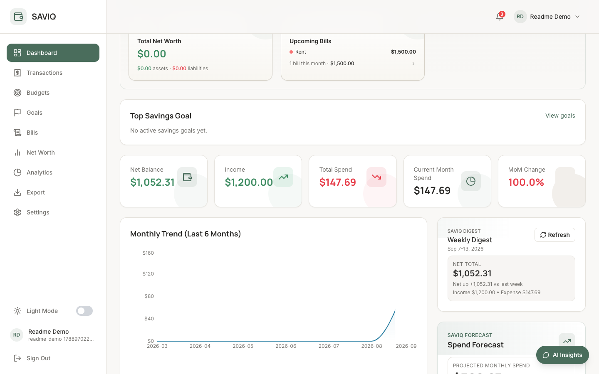
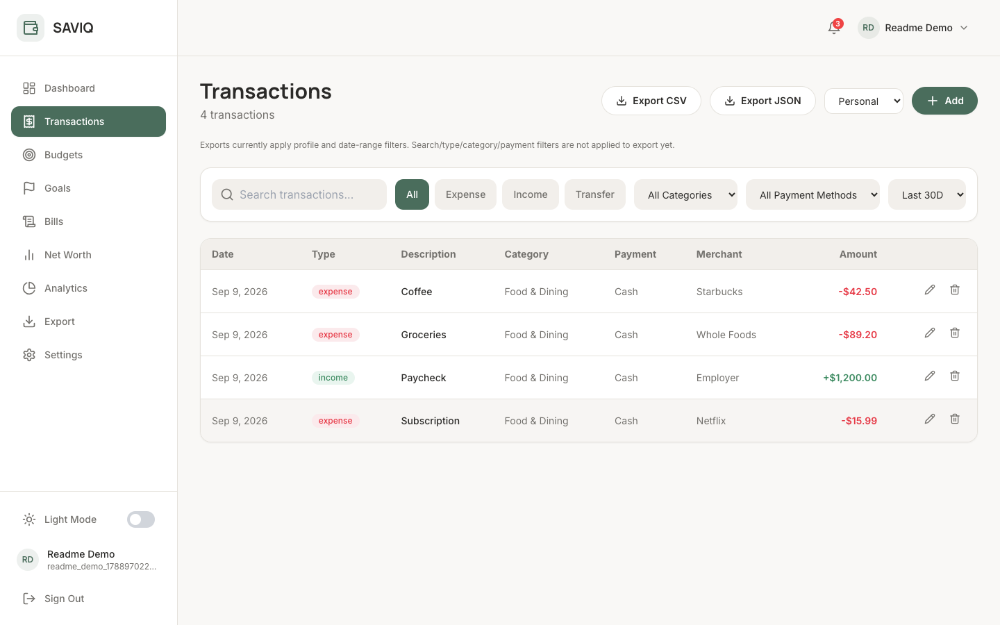
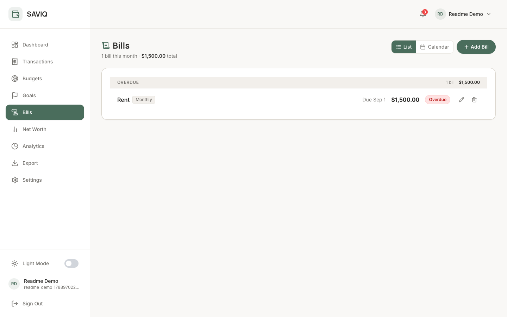
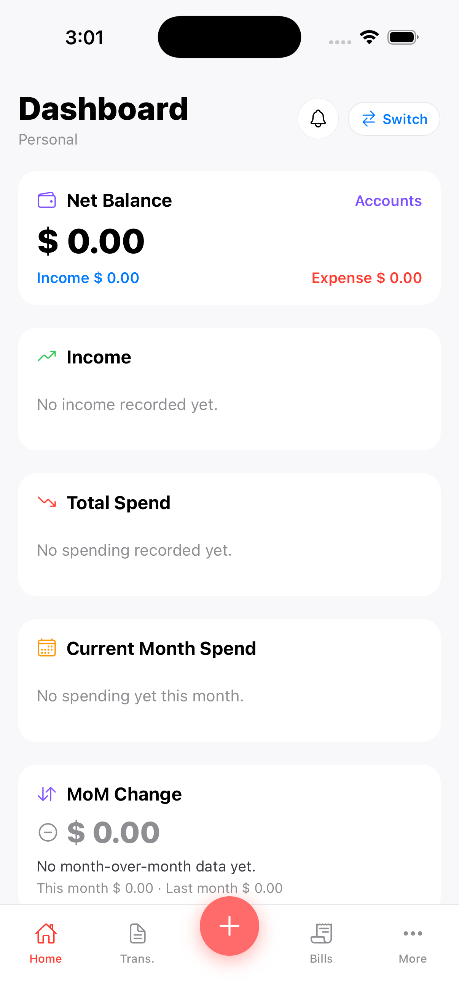
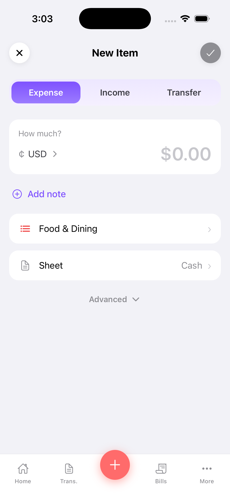
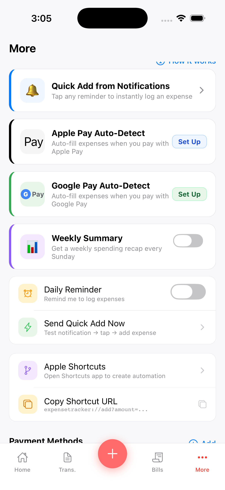
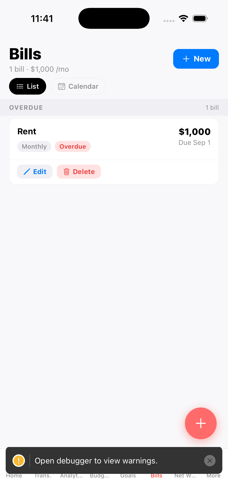
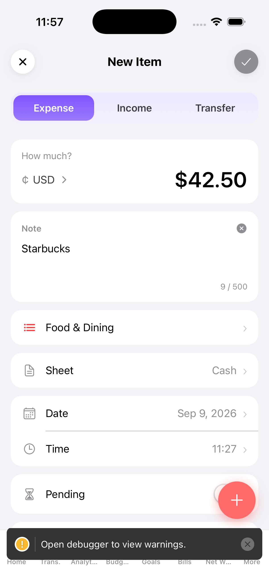

# SAVIQ

[](backend/)
[](web/)
[](frontend/)
[](backend/)
[](tests/)

**Financial intelligence for modern households and solo operators.**  
SAVIQ combines transaction tracking, forecasting, savings planning, and AI guidance across web and mobile in one profile-aware platform.

> **Current posture:** feature-complete with 5 competitive gap phases shipped. Web and mobile are at full feature parity. Ready for public beta rollout.

---

## Screenshots

### Web

| Dashboard                                            | Transactions                                               | Bills                                        |
| ---------------------------------------------------- | ---------------------------------------------------------- | -------------------------------------------- |
|  |  |  |

### Mobile

| Dashboard (5-tab dock)                                | Quick Add (collapsed)                                      | Automation                                                   |
| ----------------------------------------------------- | ---------------------------------------------------------- | ------------------------------------------------------------ |
|  |  |  |

| Bills (list)                                       | Apple Pay Auto-Fill                                                  |
| -------------------------------------------------- | -------------------------------------------------------------------- |
|  |  |

_Dashboard: the dock was cut from 8 tabs (4 of which truncated) to 5, with Add as a
centered raised button instead of a floating FAB that overlapped content. Quick Add:
logging an expense now defaults to Amount + Note + Category + Sheet, with
Date/Time/Pending/Repeat/Image tucked behind an "Advanced" disclosure. Apple Pay
Auto-Fill: an iOS Shortcuts automation deep-links into the app with amount, merchant,
and category pre-filled from the Pay transaction._

---

## Table of Contents

- [Screenshots](#screenshots)
- [Why SAVIQ](#why-saviq)
- [Core Differentiators](#core-differentiators)
- [Feature Highlights](#feature-highlights)
- [Profile Model (Current Scope)](#profile-model-current-scope)
- [Architecture Overview](#architecture-overview)
- [AI Stack and Degradation Behavior](#ai-stack-and-degradation-behavior)
- [Environment Setup](#environment-setup)
- [Local Development](#local-development)
- [Testing](#testing)
- [Mobile & Runtime Notes](#mobile--runtime-notes)
- [Release Readiness](#release-readiness)
- [Roadmap (Near-Term)](#roadmap-near-term)

---

## Why SAVIQ

Most expense apps answer **"what happened?"**. SAVIQ is designed to answer:

- **What is happening now?** (real-time spend visibility)
- **What is likely next?** (forecasting + budget risk)
- **What should I do?** (AI recommendations and guided savings)

SAVIQ exists to help users make confident financial decisions, not just log transactions.

## Core Differentiators

- **AI-native financial UX:** conversational and card-based insights integrated directly into product flows.
- **Forecast + action loop:** projections, confidence scoring, and recommendation layers tied to savings goals and budget posture.
- **Cross-platform continuity:** web and Expo mobile surfaces cover the same core financial workflows.
- **Profile-aware data boundaries:** personal/business/shared profile contexts with explicit scoped rendering and data access.
- **Net worth tracking:** assets, liabilities, and trend history across all profiles.
- **Shared profile access:** invite-based multi-user shared profiles for couples and households.
- **Push notifications:** budget alerts, goal milestones, large transaction warnings via Expo Push.
- **Transaction notes + attachments:** notes and receipt attachments on any expense, not just AI-scanned ones.
- **Recurring bill management:** bill tracker with due date alerts and subscription-to-bill promotion.

---

## Feature Highlights

### 1) Financial Dashboard & Smart Metrics

- Net balance, income, spend, month-over-month movement, top goal summary.
- Smart metrics including savings score, spend velocity, financial health, budget confidence, and projected savings.
- **Net worth card** showing total assets minus liabilities with MoM trend.
- Loading/empty/error state handling across dashboard cards and widgets.

### 2) Goals, Budgets, and Planning

- Savings goals CRUD with progress, milestones, projected completion dates, and monthly recommendation support.
- Budget tracking with risk-oriented visibility and profile-aware filtering.
- Priority goal surfacing from dashboard context.

### 3) Forecasting & Risk Intelligence

- 7-day and 30-day projection windows.
- Month-end spend forecasting and velocity modeling.
- Budget exceed risk and confidence scoring with plain-language explanation layers.

### 4) AI-Powered Intelligence

- Smart insights and recommendations on dashboard surfaces powered by Gemini 2.5 Flash.
- AI receipt scanning endpoint support (vision-capable model).
- AI chat insights (`/ai/chat-insights`) with prompt suggestions, retry/failure handling, and profile-isolated conversation context.

### 5) Weekly Digest & Recurring Spend Detection

- Weekly financial digest with narrative summary, income/expense delta, and profile switching support.
- Recurring spend detection with subscription candidates and monthly recurring totals.
- **Recurring bill management** — bills collection with due date alerts, bill vs actual matching, and calendar view.

### 6) Net Worth Tracking

- Manual assets and liabilities collections with CRUD.
- Daily snapshot cronjob for 6-month trend chart.
- Full web page + mobile screen with profile switcher.

### 7) Push Notifications

- Budget alerts, goal milestone triggers, large transaction warnings.
- Weekly digest push on Monday 9am via APScheduler.
- Deep links on notification tap to relevant screen.
- Per-type notification preference toggles in Settings.
- In-app notification bell on web with unread count badge.

### 8) Shared Profile Invite Access

- Invite partner by email to a Shared profile.
- Secure token-based accept/decline flow with 7-day expiry.
- Profile access middleware — members see same data as owner.
- Member avatars in profile switcher.
- Mobile deep link handling for invite acceptance.

### 9) Transaction Notes + Attachments

- Optional notes field (max 500 chars) on any expense.
- File attachments (jpg/png/pdf/heic) stored in Cloudflare R2.
- Camera + photo library upload on mobile via expo-image-picker.
- Notes and attachment indicators in transaction list rows.

### 10) Exports

- CSV, JSON, and PDF export, scoped by profile and date-range presets (This Month / This Year / Last Month), with a live preview before export.
- Mobile PDF export renders a formatted HTML report (summary + category breakdown + transactions) and shares it via the native iOS/Android share sheet.

### 11) Mobile Coverage

Mobile is now at full feature parity with web — every item below was audited against the web app and verified working live in an iOS simulator:

- Route-level coverage across dashboard, transactions, budgets, goals, analytics, net worth, bills, and AI chat flows.
- In-app notification center (bell icon, unread badge, mark-all-read, tap-to-navigate).
- Account deletion with typed-confirmation modal.
- Dashboard category/payment-method breakdown cards, budget progress summary, recommendations widget, and spend-comparison smart insight — all tap-through to filtered Transactions.
- Category/payment-method filters on Transactions, with deep-link pre-population from dashboard drill-downs.
- Recurring transaction end date.
- Bills Calendar view (month grid, due-day dots, status coloring) alongside the existing list view.
- Analytics period tabs (Week/Month/Year).
- Weekly Digest dismissible banner.
- AI chat "Clear conversation" button.
- **Apple Pay / Google Pay Auto-Detect** — an in-app setup guide walks the user through an iOS Shortcuts (or Android equivalent) automation that fires on a Pay transaction and deep-links straight into a pre-filled Add Expense screen (amount, merchant, category).
- Mobile-first interaction patterns, dark mode support for primary flows, and profile switching restore behavior.
- Push notification deep linking to relevant screens.

See [`MOBILE_PARITY_CHECKLIST.md`](MOBILE_PARITY_CHECKLIST.md) for the full audit trail (14/14 items, 13/14 live click-tested).

### 12) Mobile UX Pass

A follow-up review of the mobile app (post feature-parity) found and fixed four
usability issues, each verified live in a simulator:

- **Dock cut from 8 tabs to 5.** The bottom tab bar previously packed in Home,
  Transactions, Analytics, Budgets, Goals, Bills, Net Worth, and More — 4 of 8
  labels truncated (`Analyt…`, `Budg…`, `Net W…`). Now: Home, Transactions, a
  centered raised Add button, Bills, More. Analytics/Budgets/Goals/Net Worth
  moved to Home's quick-actions row and a new "Quick Links" section on More, so
  nothing lost reachability.
- **FAB integrated into the dock**, replacing a floating "+" that was
  absolute-positioned and overlapped dock icons and toast notifications.
- **Automation rows: one affordance each.** The Apple Pay / Google Pay setup
  rows previously showed both a "Set Up" pill and a chevron that did the same
  thing; the redundant chevron is gone.
- **Add Expense defaults to a 4-field quick log** (Amount, Note, Category,
  Sheet) instead of an 11-field scroll. Date, Time, Pending, Repeat, End Date,
  and Add Image now live behind a collapsible "Advanced" section (auto-expanded
  when editing an existing transaction).

See [`MOBILE_UX_CHECKLIST.md`](MOBILE_UX_CHECKLIST.md) for the full list (4/4 done).

---

## Profile Model (Current Scope)

SAVIQ supports profile switching with explicit `profile_type` values:

- `personal`
- `business`
- `shared`

Shared profiles now support **invite-based multi-user access** — a profile owner can invite a partner by email. Both users see the same transactions, budgets, goals, and AI insights scoped to that profile.

- `business` currently represents profile context and data partitioning, **not** a full multi-user organization account model.
- Ownership remains single-user scoped per authenticated account for personal and business profiles.
- Team memberships, role-based org collaboration, and org-level access are roadmap items.

---

## Architecture Overview

| Layer        | Stack                                                           | Notes                                                                                                            |
| ------------ | --------------------------------------------------------------- | ---------------------------------------------------------------------------------------------------------------- |
| Backend API  | Python, FastAPI, Pydantic, Motor/PyMongo                        | Session/auth flows, profile-scoped data model, analytics/forecast/AI endpoints                                   |
| Database     | MongoDB Atlas (cloud-hosted)                                    | 15+ collections + startup index initialization (including TTL on sessions). All indexes auto-created on startup. |
| Web App      | React + Vite, Tailwind, Recharts                                | Runs on port 3000 in dev. Product UI, dashboards, goals, analytics, net worth, bills, exports, AI chat           |
| Mobile App   | React Native (Expo)                                             | Cross-platform mobile experience with backend auth integration                                                   |
| Shared Logic | `shared/` TypeScript package                                    | Shared constants/types/utils across app surfaces                                                                 |
| AI           | Google Gemini 2.5 Flash (receipts) + Flash-Lite (insights/chat) | Via `google-genai` SDK + `litellm` routing                                                                       |
| Email        | Resend                                                          | Transactional emails — 3,000/month free tier                                                                     |
| Analytics    | PostHog                                                         | Product analytics + error tracking — 1M events/month free tier                                                   |
| Storage      | Cloudflare R2                                                   | Receipt + attachment image storage — 10GB free, zero egress fees                                                 |
| Cache        | Upstash Redis                                                   | Rate limiting persistence — 500K commands/month free tier                                                        |
| Push         | Expo Push API                                                   | Free, unlimited push notifications for mobile                                                                    |
| Testing      | `pytest`, `node:test`, Playwright                               | Backend coverage + web logic/E2E + mobile helper/orchestration tests                                             |

---

## AI Stack and Degradation Behavior

### Primary provider

- **Google Gemini** via `google-genai` SDK (replaces OpenAI for all AI features).
- Receipt scanning: `gemini-2.5-flash` (vision-capable, $0.30/$2.50 per 1M tokens).
- Insights + chat: `gemini-2.5-flash-lite` (text-only, $0.10/$0.40 per 1M tokens).
- Free dev tier: 1,500 requests/day via Google AI Studio — covers full beta traffic at $0.

### Optionality

- AI-specific configuration is optional for core CRUD and analytics flows.
- If AI is unavailable or disabled, core expense tracking, budgets, goals, net worth, bills, and non-AI analytics remain fully available.

### Feature control

- `ENABLE_AI_FEATURES` can be used to gate AI behavior by environment.
- Model values are configured via `OPENAI_RECEIPT_MODEL` and `OPENAI_INSIGHTS_MODEL` env vars (these var names are preserved for backward compatibility — just point them at Gemini model strings).

---

## Environment Setup

> ⚠️ **Important:** Backend runtime loads env from `backend/.env`. Copy from `backend/.env.example` and fill in values. See full variable reference in `SAVIQ_Environment_Variables.docx`.

### Minimum required variables

```env
# Database (MongoDB Atlas)
MONGO_URL=mongodb+srv://<username>:<password>@<cluster>.mongodb.net/saviq
DB_NAME=saviq

# Auth
JWT_SECRET=<generate with: openssl rand -base64 32>
ALLOWED_ORIGINS=http://localhost:3000,http://localhost:5173,http://localhost:8081

# Google OAuth
GOOGLE_CLIENT_IDS=web-client-id.apps.googleusercontent.com,ios-client-id.apps.googleusercontent.com
```

### AI (Gemini — recommended)

```env
GOOGLE_API_KEY=AIza...
OPENAI_RECEIPT_MODEL=gemini-2.5-flash
OPENAI_INSIGHTS_MODEL=gemini-2.5-flash-lite
```

### Optional integrations (all configured, all free tier)

```env
# Email
RESEND_API_KEY=re_...

# Analytics + error tracking
POSTHOG_API_KEY=phc_...

# Receipt + attachment image storage
CLOUDFLARE_R2_ENDPOINT=https://<account-id>.r2.cloudflarestorage.com
CLOUDFLARE_R2_BUCKET_NAME=saviq-receipts
CLOUDFLARE_R2_ACCESS_KEY_ID=...
CLOUDFLARE_R2_SECRET_ACCESS_KEY=...

# Rate limiting cache
REDIS_URL=rediss://...
```

### Frontend env files

**`web/.env`:**

```env
VITE_BACKEND_URL=http://localhost:8001
VITE_GOOGLE_CLIENT_ID=your-web-client-id.apps.googleusercontent.com
```

**`frontend/.env`:**

```env
EXPO_PUBLIC_BACKEND_URL=http://localhost:8001
EXPO_PUBLIC_GOOGLE_WEB_CLIENT_ID=your-web-client-id.apps.googleusercontent.com
EXPO_PUBLIC_GOOGLE_IOS_CLIENT_ID=your-ios-client-id.apps.googleusercontent.com
```

> **Note for physical device testing:** replace `localhost` in `EXPO_PUBLIC_BACKEND_URL` with your Mac's LAN IP (`ipconfig getifaddr en0`).

---

## Local Development

### 1) Backend

```bash
cd backend
pip install -r requirements.txt
cp .env.example .env   # then fill in your values
python -m uvicorn main:app --reload --port 8001
```

MongoDB collections and indexes are created automatically on first startup — no manual schema setup needed.

Backend API docs available at: `http://127.0.0.1:8001/docs`

### 2) Web

```bash
cd web
npm install
npm run dev
# runs on http://localhost:3000
```

### 3) Mobile (Expo)

```bash
cd frontend
npm install
npx expo start
```

Set `EXPO_PUBLIC_BACKEND_URL` to a backend URL reachable from your emulator or physical device.

---

## Testing

### Backend

```bash
pytest
```

### Web logic tests

```bash
node --test web/src/lib/*.test.mjs
```

### Web E2E (smoke/core flows)

```bash
npx playwright test
```

### Build checks

```bash
cd web && npm run build
```

---

## Mobile & Runtime Notes

- Automated mobile coverage currently emphasizes high-signal helper/state/orchestration logic.
- Full mobile UI E2E/device-matrix validation is intentionally not yet exhaustive.
- Additional runtime validation remains necessary for:
  - gesture behavior
  - lifecycle handling
  - deep links (especially invite acceptance and notification tap routing)
  - push notification delivery on physical devices

This is the primary remaining validation gap between internal beta and wider rollout confidence.

---

## Release Readiness

| Area                            | Status                                                                                      |
| ------------------------------- | ------------------------------------------------------------------------------------------- |
| Feature scope (core features)   | ✅ Complete                                                                                 |
| Competitive gap features        | ✅ Complete                                                                                 |
| Web + mobile route parity       | ✅ Complete                                                                                 |
| Web + mobile feature parity     | ✅ Complete — 14/14 gap items shipped, 13/14 live click-tested on simulator                 |
| Backend/API implementation      | ✅ Complete for all flows                                                                   |
| Automated tests                 | ✅ Strong (backend + web + targeted mobile logic)                                           |
| Environment & API keys          | ✅ All services configured (MongoDB Atlas, Gemini, Resend, PostHog, Cloudflare R2, Upstash) |
| Analytics & error tracking      | ✅ PostHog connected (free tier)                                                            |
| Push notifications              | ✅ Expo Push configured (iOS + Android)                                                     |
| Net worth tracking              | ✅ Complete (web + mobile)                                                                  |
| Shared profile invite           | ✅ Complete (web + mobile deep link)                                                        |
| Transaction notes + attachments | ✅ Complete (web + mobile camera)                                                           |
| Recurring bill management       | ✅ Complete (web + mobile)                                                                  |
| Bank sync (Teller)              | ⏸ Parked — add after first paying subscriber                                                |
| Device/runtime validation       | ⛔ Pending final pass                                                                       |
| Observability hardening         | ⚠️ PostHog connected — instrumentation in progress                                          |

**Current release posture:** ready for **public beta**. All features shipped. Bank sync deferred until paid subscribers request it.

---

## Roadmap (Near-Term)

1. **Deploy to production**
   - Backend → Railway. Web → Cloudflare Pages at `getsaviq.com`. Mobile → TestFlight (iOS) + Play Store beta (Android).
2. **Resend email integration**
   - Implement password reset and welcome email flows using `RESEND_API_KEY`.
3. **PostHog instrumentation**
   - Add event tracking to key user flows (signup, transaction add, AI insights viewed, goal created).
4. **Cloudflare R2 migration**
   - Move receipt images from MongoDB base64 storage to R2 to protect Atlas 512MB free tier.
5. **Android client ID**
   - Install Java (`brew install --cask zulu@17`), generate SHA-1, add Android OAuth client in Google Cloud Console.
6. **Device/runtime confidence**
   - Broader on-device validation across lifecycle, deep-link, and notification scenarios.
7. **Bank sync via Teller** _(after first paying subscriber)_
   - Teller preferred over Plaid — no monthly minimum, pay-as-you-go.
8. **Collaboration & business profile evolution**
   - Team/org primitives (roles, memberships, org-level access).

---

## Known Issues Fixed (Beta Setup)

The following bugs were patched during initial beta setup:

- `insights_v2_service.py` — MongoDB collection truth-value comparison fixed (`or` → `is not None`)
- `forecast_service.py`, `dashboard_metrics.py`, `insights.py`, `analytics.py` — timezone-naive vs timezone-aware datetime comparison fixed across all date filter expressions (`.replace(tzinfo=timezone.utc)`)
- `openai_client.py` — uses `responses.create()` (OpenAI Responses API); needs refactor to `chat.completions.create()` before switching to Gemini or DeepSeek
- `frontend/app/(tabs)/more.tsx` — `expo-file-system`'s SDK 54 legacy API (`writeAsStringAsync`/`moveAsync`) started throwing unconditionally after a dependency version bump, silently breaking CSV/JSON/PDF export on mobile behind a misleading "check your connection" error; fixed by importing from `expo-file-system/legacy`.
- Web dashboard "Top Category" Smart Metric and the Weekly Digest narrative displayed a raw `category_id` (e.g. `cat_4d1ba7e8483e`) instead of the category's name — the dashboard metric was already fixed by the audit pass below; the digest narrative was missing the same `category_id → name` lookup in `weekly_digest_service.py`, fixed by adding a `categories_collection` param and building the same map used in `dashboard_metrics.py`.

---

SAVIQ is a production-ready beta: feature-complete, cross-platform, AI-augmented, and ahead of all three main competitors on receipt scanning and multi-profile isolation. The remaining work is deployment, observability hardening, and device validation.
